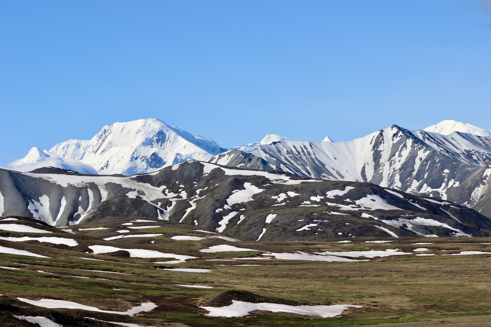

<!-- Section -->
<section>
	<header class="major">
		<h2>Ipsum sed dolor</h2>
	</header>
	

		<article>
			
			<h3>About me</h3>
			
Personal and educational background

			<ul class="actions">
				<li><a href="#" class="button">About me</a></li>
			</ul>
		</article>
		<article>
			
			<h3>Capacity building</h3>
			
Ocean science capacity building efforts in Nigeria & Ghana

			<ul class="actions">
				<li><a href="#" class="button">Capacity building</a></li>
			</ul>
		</article>
		<article>
			
			<h3>Teaching</h3>
			
Teaching

			<ul class="actions">
				<li><a href="#" class="button">Teaching</a></li>
			</ul>
		</article>
		<article>
			
			<h3>Fieldwork</h3>
			
Fieldwork

			<ul class="actions">
				<li><a href="#" class="button">Fieldwork</a></li>
			</ul>
		</article>
		<article>
			
			<h3>Research</h3>
			
Research

			<ul class="actions">
				<li><a href="#" class="button">Research</a></li>
			</ul>
		</article>
		<article>
			
			<h3>Outdoor recreation</h3>
			
Outdoor recreation

			<ul class="actions">
				<li><a href="#" class="Outdoor recreation">More</a></li>
			</ul>
		</article>
	

</section>
