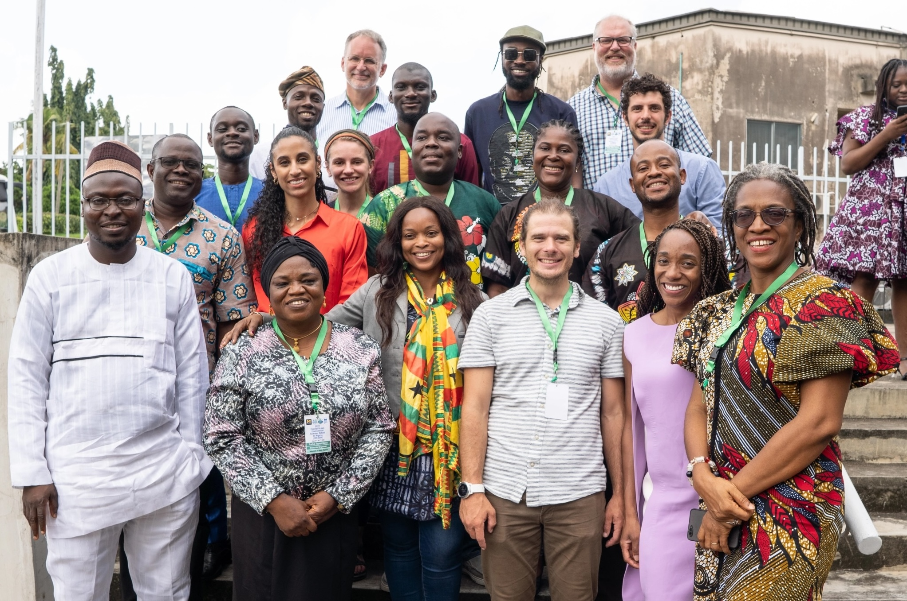
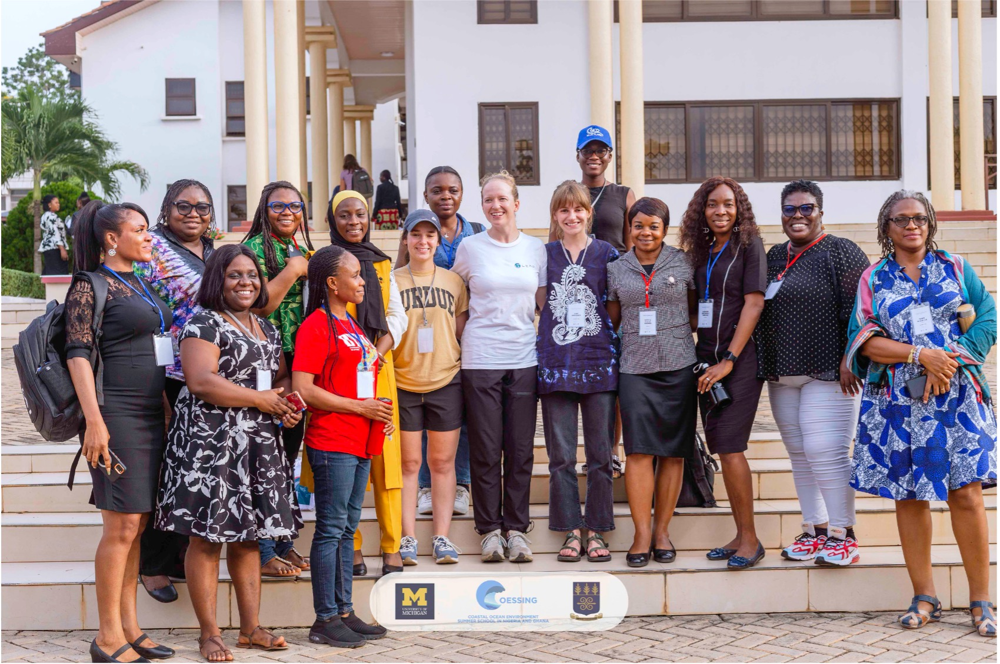
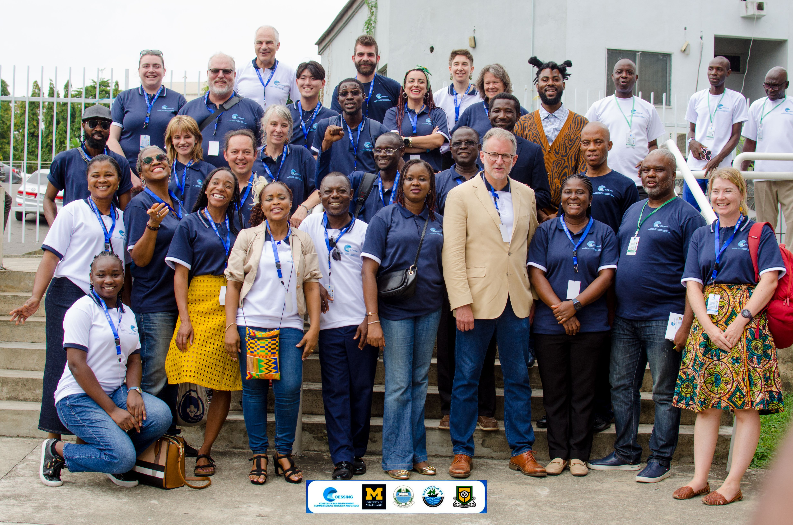

## The Coastal Ocean Environment Summer School in Nigeria and Ghana [(COESSING)](https://coessing.org/)
COESSING is an annual, week-long, interdisciplinary summer program in West Africa aimed at bolstering ocean science capacity in the region and connecting West African scientists with both one other and with institutions abroad. Each summer, the program brings together some ~100+ earth scientists, engineers, and other professionals with a stake in the coastal ocean. While the format of the program has changed over time, the week generally consists of a mix of research talks, short lectures, programming tutorials, hands-on projects, field trips to either collect data for projects or to visit goverment labs, and group discussions. (If this sounds jam-packed, it's because it is!) I have been involved in the program as both an instructor (leading Python tutorials and various physical oceanography projects) and occasionally as an organizer since the beginning of my PhD. 

  

    

    

    

  

#### Python/Physical Oceanography Instructor, University of Ghana, Ghana, 2025 (1 week)
Gave an "Intro to Ocean Modeling" lecture and lead several Jupyter Notebook/Google Colab notebook tutorials for exploring ROMS model output of the Gulf of Guinea (model developed by John Wilkin and Elias Hunter at Rutgers), for a large group. Ahead of the summer school, I organized a brief Python bootcamp over Zoom and lead an intro-to-Xarray tutorial. I served as the 2025 Physical Oceanography track lead (lead meetings, oversaw curriculum and admissions).
#### Python/Physical Oceanography Instructor, University of Lagos, Nigeria, 2024 (1 week)
Gave a series of introductory Python tutorials as a part of our group's "Python bootcamp." Lead a project for a small group (following the Python bootcamp) which examines the frequency content of tide gauge records around West Africa. I served as the 2024 Physical Oceanography track lead (lead meetings, oversaw curriculum).
#### Python/Physical Oceanography Instructor, University of Ghana, Ghana, 2023 (1 week)
Lead a project for a small group which consisted of several GFD whiteboard lessons and running Python OpenDrift simulations of buoyant particles (e.g. plastics) with and without Stokes' Drift enabled in the model. I was a memeber of the COESSING 2023 organizing committee. 
#### Lecturer for the Virtual COESSING 2023 (1 week)
Gave a lecture entitled "The Physics of Estuaries" covering fundamentals of estuarine circulation and different behaviors of dissolved and particulate pollutants in shallow estuaries. Coordinated Google Jamboard discussions about the importance of estuaries in Ghana. I served as an organizer and moderator for the virtual program.
#### Instructor, University of Lagos, Nigeria, 2022 (1 week)
Assissted with Python tutorials in a TA-like capacity. Helped troubleshoot Anaconda installations, environment setup, and Jupyter notebook activites. Met with a handful of participants on an individual basis to recreate their own publication figures in Python. This was before COESSING shifted to project-based learning. 
## Rutgers University
#### Teaching Assistant for Introduction to Physical Oceanography (graduate course), Fall 2022
#### Guest Lecture for Introduction to Ocean Modeling, Fall 2022
#### Teaching Assistant for Software Bootcamp (graduate course), Summer 2022
