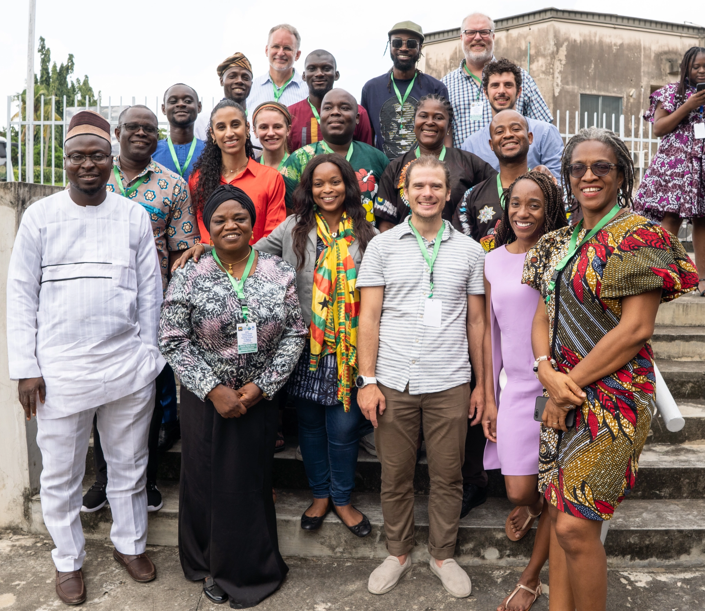

## The Coastal Ocean Environment Summer School in Nigeria and Ghana [(COESSING)](https://coessing.org/)
COESSING is an annual, week-long, interdisciplinary summer program in West Africa aimed at bolstering ocean science capacity in the region and connecting West African scientists with both one other and with institutions abroad. Each summer, the program brings together some ~100+ earth scientists, engineers, and other professionals with a stake in the coastal ocean. While the format of the program has changed over time, the week generally consists of a mix of research talks, short lectures, programming tutorials, hands-on projects, field trips to either collect data for projects or to visit goverment labs, and group discussions. (If this sounds jam-packed, it's because it is!) I have been involved in the program as both an instructor (leading Python tutorials and various physical oceanography projects) and occasionally as an organizer since the beginning of my PhD. 

  

    

    

    

  

#### Physical Oceanography Instructor, University of Ghana, Ghana, 2025 (UPCOMING)
#### Physical Oceanography Instructor, University of Lagos, Nigeria, 2024 (1 week)
#### Physical Oceanography Instructor, University of Ghana, Ghana, 2023 (1 week)
#### Organizer and Lecturer for the Virtual COESSING 2023 (1 week)
#### Instructor, University of Lagos, Nigeria, 2022 (1 week)

## Rutgers University
#### Teaching Assistant for Introduction to Physical Oceanography (graduate course), Fall 2022
#### Guest Lecture for Introduction to Ocean Modeling, Fall 2022
#### Teaching Assistant for Software Bootcamp (graduate course), Summer 2022
